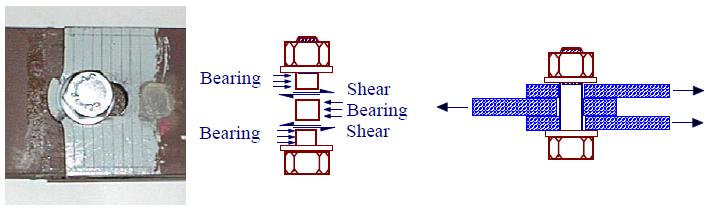

## Многомодульная программа
### Консольное приложение "Проверка болтового соединения на срез и смятие"

#### Цель разработки:

Проверка болтового соединения на срез и смятие с помощью настольного приложения по формулам СП 16.13330 

(<a href="#readme-top">вверх</a>)

