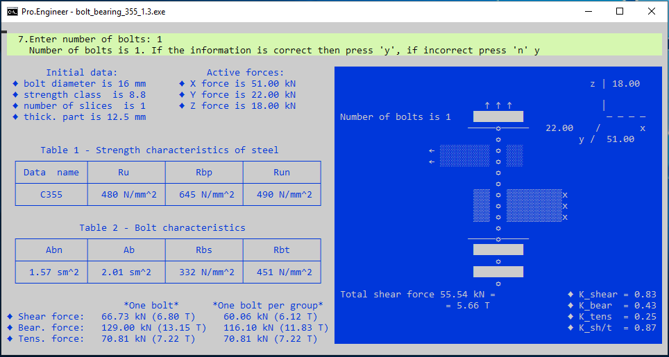

## Многомодульная программа
### Консольное приложение "Проверка болтового соединения на срез и смятие"

#### Цель разработки:

Проверка болтового соединения на срез и смятие с помощью настольного приложения по формулам 

СП 16.13330.2017:

#### Приложение позволяет:

* учесть суммарное срезающее усилие, направленное по осям X и Y в плоскости среза болта;

* учесть растягивающее усилие, направленное по оси Z, в направлении перпендикулярном плоскости среза;

* учесть одновременное действие на болтовое соединение усилий, вызывающих срез и растяжение болтов.

#### Терминал для ввода и вывода информации:

#### Файлы с данными, необходимые для работы приложения:

* tabl_B_3.csv (Таблица В.3*).
При составлении таблицы предполагался вариант соединения 2-х элементов из листа или же фасонного элемента с листом как худший вариант;
* tabl_G_5.csv (Таблица Г.5**);
* tabl_G_6.csv (Таблица Г.6**);
* tabl_G_9.csv (Таблица Г.9**).

#### При отсутствии необходимых для работы файлов, проложение сообщает пользователю об этом:

Приложение имеет текстовый интерфейс пользователя. Такая возможность, при разработке в Windows, предоставляется библиотекой управления терминалом **curses.h**.

~~~

*  Приложение В СП 16.13330.2017;
** Приложение Г СП 16.13330.2017.

~~~

(<a href="#readme-top">вверх</a>)

